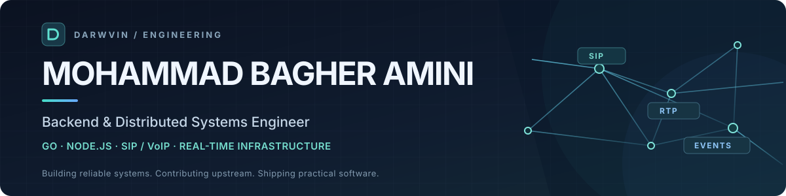

 

# Hi, I'm Mohammad Bagher Amini 👋

**Senior Backend & Distributed Systems Engineer** specializing in **Go, Node.js, high-concurrency services, and real-time communications (SIP/VoIP).**

I build systems where reliability is part of the design: from SIP signaling and RTP-aware infrastructure to event-driven backends, observability, automation, and developer tools. I enjoy working close to protocols, performance bottlenecks, and production operations — then turning that complexity into software people can actually use.

**My engineering focus**

- **Distributed backends:** Go, Node.js, asynchronous processing, Kafka, Redis, PostgreSQL, queues, retries, and concurrency.
- **Real-time telecom:** SIP, SDP, RTP/RTCP, media relays, NAT traversal, registration, routing, and load testing.
- **Production engineering:** Linux, containers, CI/CD, diagnostics, observability, profiling, and failure recovery.
- **Product development:** Cross-platform desktop apps, developer-facing APIs, and practical operational interfaces.

## Open source · Work that shipped upstream

I care about contributions that can be reviewed, tested, and used by the wider engineering community.

**[SIPp](https://github.com/SIPp/sipp)** — merged contributions to SIP traffic testing and media diagnostics:

| Area | Merged upstream contribution |
| :-- | :-- |
| Media quality | [RTCP/SRTCP QoS analysis and MOS estimation](https://github.com/SIPp/sipp/pull/1279) |
| NAT & WebRTC | [ICE connectivity, STUN and TURN diagnostic probes](https://github.com/SIPp/sipp/pull/1280) |
| Media security | [DTLS-SRTP handshake diagnostic probe](https://github.com/SIPp/sipp/pull/1281) |
| Network simulation | [RTP/RTCP media impairment proxy](https://github.com/SIPp/sipp/pull/1278) |
| CI & automation | [Threshold reports and machine-readable results](https://github.com/SIPp/sipp/pull/1277) |
| SIP protocol tooling | [Configurable Call-ID generators](https://github.com/SIPp/sipp/pull/869) |

**[sngrep](https://github.com/irontec/sngrep)** — [Call State filtering](https://github.com/irontec/sngrep/pull/570), merged upstream.

**[OpenSIPS](https://github.com/OpenSIPS/opensips)** — ongoing upstream proposals in [SIP call tracing with OpenTelemetry](https://github.com/OpenSIPS/opensips/pull/4308), [SIP overload control](https://github.com/OpenSIPS/opensips/pull/4307), and [ICE/DTLS-SRTP policy enforcement](https://github.com/OpenSIPS/opensips/pull/4305). *These are proposals, not presented as merged features.*

> **What I optimize for:** reproducible tests, clear failure modes, operational visibility, and maintainable implementations.

## What I'm building

<table>
<tr>
<td width="33%" valign="top">
<h3>📡 DarwPhone</h3>

A SIP softphone project spanning native call-engine integration and cross-platform user experiences.

In development · Real-time communications
</td>
<td width="33%" valign="top">
<h3>🖥️ RemoteOpsX</h3>

Remote operations tooling focused on secure access, server workflows, and practical diagnostics.

In development · Developer / IT operations
</td>
<td width="33%" valign="top">
<h3>📊 PBX Nexus</h3>

A desktop workspace for connecting to existing PBX servers, inspecting health, and simplifying telecom operations.

In development · VoIP infrastructure
</td>
</tr>
</table>

*These are active product projects; the corresponding codebases are not presented here as publicly released products.*

## The technology behind the work

| Engineering | Technologies & practices |
| :-- | :-- |
| **Backend & architecture** | Go, Node.js, TypeScript, REST APIs, services, workers, event-driven design |
| **Data & messaging** | PostgreSQL, Redis, Kafka, SQL and data pipelines |
| **Telecom & media** | SIP, SDP, RTP/RTCP, RTPengine, Asterisk, FreeSWITCH, OpenSIPS, SIPp |
| **Infrastructure** | Linux, Docker, Nginx, CI/CD, observability, performance testing |
| **UI & product delivery** | React, cross-platform desktop tooling, APIs, operator-focused UX |

## Recent open-source activity

<b>Browse my latest pull requests (automatically updated)</b>

<!-- CONTRIBUTIONS:START -->
### SIPp Contributions

- [tools: add DTLS-SRTP diagnostic handshake probe](https://github.com/SIPp/sipp/pull/1281) — `merged`
- [tools: add ICE connectivity, STUN and TURN probes](https://github.com/SIPp/sipp/pull/1280) — `merged`
- [tools: add RTCP/SRTCP QoS analysis and MOS estimation](https://github.com/SIPp/sipp/pull/1279) — `merged`
- [tools: add RTP/RTCP media impairment proxy](https://github.com/SIPp/sipp/pull/1278) — `merged`
- [tools: add CI-native threshold reports and machine-readable results](https://github.com/SIPp/sipp/pull/1277) — `merged`

### Recent Open Source PRs

- [[tls_mgm] Add TLS handshake outcome and latency statistics](https://github.com/OpenSIPS/opensips/pull/4309) — `closed`
- [[opentelemetry] Add optional SIP call correlation across messages](https://github.com/OpenSIPS/opensips/pull/4308) — `open`
- [[sip_overload] Add RFC 7339/7415 SIP overload control](https://github.com/OpenSIPS/opensips/pull/4307) — `open`
- [[secrets] Add env, file, Vault and Kubernetes secret providers](https://github.com/OpenSIPS/opensips/pull/4306) — `open`
- [[media_security] Add ICE/TURN and DTLS-SRTP SDP policy enforcement](https://github.com/OpenSIPS/opensips/pull/4305) — `open`

Last updated automatically by GitHub Actions.
<!-- CONTRIBUTIONS:END -->

---

### Let's connect

Interested in **distributed systems, telecom infrastructure, open source, or building reliable software**?

<a href="https://www.linkedin.com/in/mohammad-bagher-amini-aa258b423/"><b>LinkedIn</b></a> &nbsp;·&nbsp; <a href="mailto:darwvin@hotmail.com"><b>Email</b></a> &nbsp;·&nbsp; <a href="https://github.com/darwvin-dev?tab=repositories"><b>Repositories</b></a>

Less hype. Better systems.

